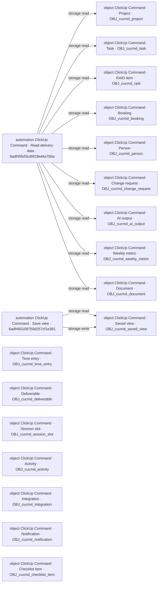

Tenant orbit.uat.unifyapps.com · solution "Clickup · ClickUp Delivery command dashboard" (e_6adf231a08f96579541331a5)

```mermaid
flowchart LR
  n1["automation ClickUp Command · Read delivery data · 6adf45fef3cd5f19ed4a76ba"]
  n2["automation ClickUp Command · Save view · 6adf460108750d257cf1e381"]
  n3["object ClickUp Command · Project · OBJ_cucmd_project"]
  n4["object ClickUp Command · RAID item · OBJ_cucmd_raid"]
  n5["object ClickUp Command · Task · OBJ_cucmd_task"]
  n6["object ClickUp Command · Time entry · OBJ_cucmd_time_entry"]
  n7["object ClickUp Command · Change request · OBJ_cucmd_change_request"]
  n8["object ClickUp Command · Person · OBJ_cucmd_person"]
  n9["object ClickUp Command · Booking · OBJ_cucmd_booking"]
  n10["object ClickUp Command · Deliverable · OBJ_cucmd_deliverable"]
  n11["object ClickUp Command · Session slot · OBJ_cucmd_session_slot"]
  n12["object ClickUp Command · Document · OBJ_cucmd_document"]
  n13["object ClickUp Command · Activity · OBJ_cucmd_activity"]
  n14["object ClickUp Command · AI output · OBJ_cucmd_ai_output"]
  n15["object ClickUp Command · Weekly metric · OBJ_cucmd_weekly_metric"]
  n16["object ClickUp Command · Saved view · OBJ_cucmd_saved_view"]
  n17["object ClickUp Command · Integration · OBJ_cucmd_integration"]
  n18["object ClickUp Command · Notification · OBJ_cucmd_notification"]
  n19["object ClickUp Command · Checklist item · OBJ_cucmd_checklist_item"]
  n1 -->|storage read| n3
  n1 -->|storage read| n5
  n1 -->|storage read| n4
  n1 -->|storage read| n9
  n1 -->|storage read| n8
  n1 -->|storage read| n7
  n1 -->|storage read| n14
  n1 -->|storage read| n15
  n1 -->|storage read| n12
  n2 -->|storage read| n16
  n2 -->|storage write| n16
```
