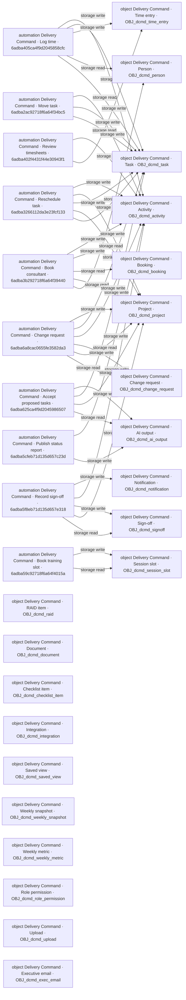

Tenant orbit.uat.unifyapps.com · solution "Clickup · ClickUp Delivery command platform" (e_6adb4b845236864dd8b18935)

```mermaid
flowchart LR
  n1["automation Delivery Command · Move task · 6adba2ac92718f6a64f34bc5"]
  n2["automation Delivery Command · Reschedule task · 6adba3266112da3e23fcf133"]
  n3["automation Delivery Command · Book consultant · 6adba3b292718f6a64f39440"]
  n4["automation Delivery Command · Review timesheets · 6adba402f4431f44e30943f1"]
  n5["automation Delivery Command · Log time · 6adba405ca4f9d2045858cfc"]
  n6["automation Delivery Command · Book training slot · 6adba59c92718f6a64f4015a"]
  n7["automation Delivery Command · Publish status report · 6adba5cfeb71d135d657c23d"]
  n8["automation Delivery Command · Record sign-off · 6adba5f8eb71d135d657e318"]
  n9["automation Delivery Command · Accept proposed tasks · 6adba625ca4f9d2045986507"]
  n10["automation Delivery Command · Change request · 6adba6a8cac0655fe3582da3"]
  n11["object Delivery Command · Task · OBJ_dcmd_task"]
  n12["object Delivery Command · Project · OBJ_dcmd_project"]
  n13["object Delivery Command · RAID item · OBJ_dcmd_raid"]
  n14["object Delivery Command · Booking · OBJ_dcmd_booking"]
  n15["object Delivery Command · Time entry · OBJ_dcmd_time_entry"]
  n16["object Delivery Command · Person · OBJ_dcmd_person"]
  n17["object Delivery Command · Change request · OBJ_dcmd_change_request"]
  n18["object Delivery Command · Document · OBJ_dcmd_document"]
  n19["object Delivery Command · Session slot · OBJ_dcmd_session_slot"]
  n20["object Delivery Command · Activity · OBJ_dcmd_activity"]
  n21["object Delivery Command · Sign-off · OBJ_dcmd_signoff"]
  n22["object Delivery Command · Checklist item · OBJ_dcmd_checklist_item"]
  n23["object Delivery Command · Notification · OBJ_dcmd_notification"]
  n24["object Delivery Command · Integration · OBJ_dcmd_integration"]
  n25["object Delivery Command · Saved view · OBJ_dcmd_saved_view"]
  n26["object Delivery Command · AI output · OBJ_dcmd_ai_output"]
  n27["object Delivery Command · Weekly snapshot · OBJ_dcmd_weekly_snapshot"]
  n28["object Delivery Command · Weekly metric · OBJ_dcmd_weekly_metric"]
  n29["object Delivery Command · Role permission · OBJ_dcmd_role_permission"]
  n30["object Delivery Command · Upload · OBJ_dcmd_upload"]
  n31["object Delivery Command · Executive email · OBJ_dcmd_exec_email"]
  n1 -->|storage read| n11
  n1 -->|storage write| n11
  n1 -->|storage write| n20
  n2 -->|storage read| n11
  n2 -->|storage read| n12
  n2 -->|storage write| n11
  n2 -->|storage write| n12
  n2 -->|storage write| n20
  n3 -->|storage read| n16
  n3 -->|storage read| n12
  n3 -->|storage read| n14
  n3 -->|storage write| n14
  n3 -->|storage write| n20
  n4 -->|storage write| n15
  n4 -->|storage write| n20
  n5 -->|storage read| n11
  n5 -->|storage read| n16
  n5 -->|storage write| n15
  n5 -->|storage write| n11
  n5 -->|storage write| n20
  n6 -->|storage read| n19
  n6 -->|storage write| n19
  n7 -->|storage write| n26
  n7 -->|storage write| n20
  n8 -->|storage read| n21
  n8 -->|storage read| n12
  n8 -->|storage write| n21
  n8 -->|storage write| n20
  n8 -->|storage write| n23
  n9 -->|storage read| n26
  n9 -->|storage read| n12
  n9 -->|storage write| n11
  n9 -->|storage write| n26
  n10 -->|storage read| n17
  n10 -->|storage read| n12
  n10 -->|storage write| n17
  n10 -->|storage write| n20
  n10 -->|storage write| n11
  n10 -->|storage write| n12
```
