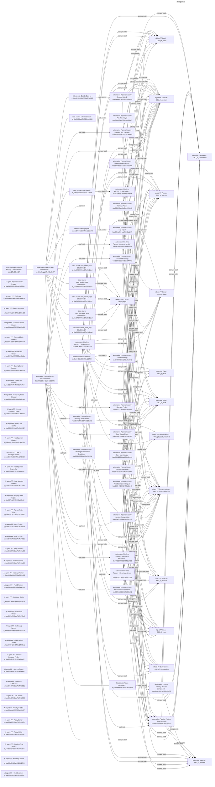

Tenant orbit.uat.unifyapps.com · solution "UnifyApps · Pipeline Factory v1" (e_6ae5bfc3b4f0d14b27962a04)

```mermaid
flowchart LR
  n1["app UnifyApps Pipeline Factory Control Tower · app-2fbe93e8c1f7"]
  n2["page global-page-of-app-2fbe93e8c1f7 · e_global_app-2fbe93e8c1f7"]
  n3["data source Pause component · e_6ae849e0afe7fc590a1c44d8"]
  n4["data source Book meeting · e_6ae849dfd96c5f6ba22ff4e0"]
  n5["data source Clear Gate 2 · e_6ae849dfd96c5f6ba22ff4dc"]
  n6["data source Ask the analyst · e_6ae849dfafe7fc590a1c44d4"]
  n7["data source Decide Gate 1 · e_6ae84964d96c5f6ba22bd626"]
  n8["data source data_delete_app-2fbe93e8c1f7 · e_6ae84846f410ab7b2ffc1bb9"]
  n9["data source data_update_app-2fbe93e8c1f7 · e_6ae84846f410ab7b2ffc1bb5"]
  n10["data source data_create_app-2fbe93e8c1f7 · e_6ae84846f410ab7b2ffc1bb2"]
  n11["data source data_fetchOne_app-2fbe93e8c1f7 · e_6ae84846f410ab7b2ffc1bad"]
  n12["data source data_fetch_app-2fbe93e8c1f7 · e_6ae84846f410ab7b2ffc1ba8"]
  n13["data source Log signal · e_6ae84846d96c5f6ba22bb5f0"]
  n14["automation Pipeline Factory · Save hand-off · 6ae840a5fbdd550a9a44c524"]
  n15["automation Pipeline Factory · Clear Gate 2 · 6ae840d7f6f76639f8ceb67d"]
  n16["automation Pipeline Factory · Log signal · 6ae843cc9594aa458cba14d7"]
  n17["automation Pipeline Factory · Pause component · 6ae843d1f6f76639f8cf2d55"]
  n18["automation Pipeline Factory · Read factory records · 6ae843e69ec43c6ee2dec988"]
  n19["automation Pipeline Factory · Decide Gate 1 · 6ae8440df13e536c52c5d959"]
  n20["automation Pipeline Factory · Reset demo · 6ae8441df38e327618fcc13c"]
  n21["automation Pipeline Factory · Book meeting · 6ae84449f38e327618fcc640"]
  n22["automation Pipeline Factory · Ask the analyst · 6ae84900fbdd550a9a465807"]
  n23["automation Pipeline Factory · Contact Finder · 6ae862f3f13e536c52e76ecd"]
  n24["automation Pipeline Factory · Alarm and Escalation · 6ae863282099302ffb2cf702"]
  n25["automation Pipeline Factory · Account Ranking · 6ae8632c9ec43c6ee22f380d"]
  n26["automation Pipeline Factory · Read component inputs · 6ae8635446920244f3d5194b"]
  n27["automation Pipeline Factory · Send Rules Check · 6ae863842099302ffb2d0262"]
  n28["automation Pipeline Factory · Weekly Slot Planner · 6ae863a5f38e327618183dca"]
  n29["automation Pipeline Factory · Content Handoff · 6ae863d0fbdd550a9a4ffc58"]
  n30["automation Pipeline Factory · Reset agent runs · 6ae863f02099302ffb2d2358"]
  n31["automation Pipeline Factory · Holdout Picker · 6ae864059ec43c6ee22f8008"]
  n32["automation Pipeline Factory · Email Domain Swapper · 6ae864342099302ffb2d2a71"]
  n33["automation Pipeline Factory · Do-Not-Contact List · 6ae864672099302ffb2d3157"]
  n34["automation Pipeline Factory · Save agent output · 6ae864829594aa458cc1ce69"]
  n35["automation Pipeline Factory · Outreach Launcher · 6ae864929594aa458cc23de9"]
  n36["automation Pipeline Factory · Privacy and Consent · 6ae86493f38e32761818a2c1"]
  n37["automation Pipeline Factory · Run component · 6ae865229ec43c6ee2300d8d"]
  n38["automation Pipeline Factory · Meeting Handoff and Deadlines · 6ae8654d2099302ffb2d9514"]
  n39["object PF Patch · OBJ_pf_patch"]
  n40["object PF Account · OBJ_pf_account"]
  n41["object PF Person · OBJ_pf_person"]
  n42["object PF Signal · OBJ_pf_signal"]
  n43["object PF Fact · OBJ_pf_fact"]
  n44["object PF Draft · OBJ_pf_draft"]
  n45["object PF Hand-off · OBJ_pf_handoff"]
  n46["object PF Component · OBJ_pf_component"]
  n47["object PF Seed snapshot · OBJ_pf_seed_snapshot"]
  n48["object PF Component run · OBJ_pf_component_run"]
  n49["object PF Source · OBJ_pf_source"]
  n50["object PF Inbox · OBJ_pf_inbox"]
  n51["object PF Suppression · OBJ_pf_suppression"]
  n52["AI agent Pipeline Factory Analyst · e_6ae846ffd96c5f6ba22b98da"]
  n53["AI agent PF · Fit Scorer · e_6ae86666d96c5f6ba243ce26"]
  n54["AI agent PF · Patch Suggester · e_6ae8666ad96c5f6ba243ce39"]
  n55["AI agent PF · Current Vendor Finder · e_6ae8666dafe7fc590a4a3d96"]
  n56["AI agent PF · Renewal Date Finder · e_6ae86671d96c5f6ba243ce77"]
  n57["AI agent PF · Battlecard Writer · e_6ae86673afe7fc590a4a3dda"]
  n58["AI agent PF · Buying Signal Spotter · e_6ae8667ed96c5f6ba243cf29"]
  n59["AI agent PF · Duplicate Finder · e_6ae86680afe7fc590a4a3f53"]
  n60["AI agent PF · Company Facts Collector · e_6ae86682d96c5f6ba243cf48"]
  n61["AI agent PF · Parent Company Linker · e_6ae86684d96c5f6ba243cf6a"]
  n62["AI agent PF · Use Case Matcher · e_6ae86685f410ab7b2f151b2f"]
  n63["AI agent PF · Headquarters Finder · e_6ae86687d96c5f6ba243cfb8"]
  n64["AI agent PF · Case for Change Drafter · e_6ae86689d96c5f6ba243cfd8"]
  n65["AI agent PF · Headquarters Re-checker · e_6ae8668bafe7fc590a4a3fec"]
  n66["AI agent PF · New Account Finder · e_6ae8668ef410ab7b2f151c47"]
  n67["AI agent PF · Buying Team Mapper · e_6ae867cdafe7fc590a4f8e82"]
  n68["AI agent PF · Person Notes Writer · e_6ae867d2f410ab7b2f155861"]
  n69["AI agent PF · Intro Finder · e_6ae867d4f410ab7b2f155959"]
  n70["AI agent PF · Play Picker · e_6ae86821f410ab7b2f15695c"]
  n71["AI agent PF · Page Builder · e_6ae86825f410ab7b2f156a03"]
  n72["AI agent PF · Content Picker · e_6ae86828f410ab7b2f156a22"]
  n73["AI agent PF · Message Writer · e_6ae8682ad96c5f6ba2441a16"]
  n74["AI agent PF · Fact Checker · e_6ae8682ed96c5f6ba2441a5f"]
  n75["AI agent PF · Message Grader · e_6ae8687bd96c5f6ba2442526"]
  n76["AI agent PF · Call Script Writer · e_6ae8687ef410ab7b2f1575c6"]
  n77["AI agent PF · Follow-up Planner · e_6ae86881d96c5f6ba244257b"]
  n78["AI agent PF · Inbox Health Checker · e_6ae86884d96c5f6ba24425cc"]
  n79["AI agent PF · Winning Message Finder · e_6ae86bd2afe7fc590a500c5f"]
  n80["AI agent PF · Scoring Tuner · e_6ae86bd6afe7fc590a500cfa"]
  n81["AI agent PF · Objection Collector · e_6ae86bd8f410ab7b2f202521"]
  n82["AI agent PF · A/B Tester · e_6ae86bdbf410ab7b2f202568"]
  n83["AI agent PF · Quality Grader · e_6ae86bdeafe7fc590a500d57"]
  n84["AI agent PF · Reply Sorter · e_6ae86bebf410ab7b2f20260c"]
  n85["AI agent PF · Reply Writer · e_6ae86beff410ab7b2f20266c"]
  n86["AI agent PF · Meeting Prep Writer · e_6ae86bf3f410ab7b2f2026ba"]
  n87["AI agent PF · Meeting Labeler · e_6ae86bf7f410ab7b2f202726"]
  n88["AI agent PF · Deal Qualifier · e_6ae86bfbf410ab7b2f202747"]
  n89["object object_type · object_type"]
  n1 --- n2
  n2 --- n3
  n2 --- n4
  n2 --- n5
  n2 --- n6
  n2 --- n7
  n2 --- n8
  n2 --- n9
  n2 --- n10
  n2 --- n11
  n2 --- n12
  n2 --- n13
  n3 -->|data source| n17
  n4 -->|data source| n21
  n5 -->|data source| n15
  n6 -->|data source| n22
  n7 -->|data source| n19
  n8 -->|storage read| n89
  n9 -->|storage read| n89
  n10 -->|storage read| n89
  n11 -->|storage read| n89
  n12 -->|storage read| n89
  n13 -->|data source| n16
  n14 -->|storage read| n46
  n14 -->|storage write| n45
  n14 -->|storage read| n45
  n15 -->|storage read| n44
  n15 -->|storage write| n44
  n15 -->|storage read| n40
  n15 -->|storage read| n41
  n16 -->|storage read| n40
  n16 -->|storage read| n42
  n16 -->|storage write| n42
  n16 -->|storage write| n40
  n16 -->|call node| n14
  n17 -->|storage read| n46
  n17 -->|storage write| n46
  n17 -->|storage write| n45
  n18 -->|storage read| n39
  n18 -->|storage read| n40
  n18 -->|storage read| n45
  n18 -->|storage read| n46
  n18 -->|storage read| n41
  n19 -->|storage read| n40
  n19 -->|storage write| n40
  n19 -->|call node| n14
  n19 -->|storage read| n39
  n19 -->|storage write| n39
  n20 -->|storage write| n39
  n20 -->|storage write| n40
  n20 -->|storage write| n41
  n20 -->|storage write| n42
  n20 -->|storage write| n43
  n20 -->|storage write| n44
  n20 -->|storage write| n45
  n20 -->|storage write| n46
  n20 -->|storage write| n47
  n20 -->|storage read| n47
  n20 -->|storage read| n39
  n20 -->|storage read| n40
  n20 -->|storage read| n41
  n20 -->|storage read| n42
  n20 -->|storage read| n43
  n20 -->|storage read| n44
  n20 -->|storage read| n45
  n20 -->|storage read| n46
  n20 -->|call node| n30
  n21 -->|storage read| n40
  n21 -->|storage write| n40
  n21 -->|call node| n14
  n23 -->|storage read| n40
  n23 -->|storage read| n41
  n23 -->|storage read| n49
  n23 -->|storage read| n51
  n23 -->|storage write| n41
  n23 -->|storage write| n49
  n23 -->|storage write| n48
  n24 -->|storage read| n46
  n24 -->|storage read| n39
  n24 -->|storage read| n45
  n24 -->|storage read| n48
  n24 -->|call node| n17
  n24 -->|storage write| n48
  n24 -->|call node| n14
  n25 -->|storage read| n39
  n25 -->|storage read| n40
  n25 -->|storage read| n42
  n25 -->|storage write| n40
  n25 -->|call node| n14
  n25 -->|storage write| n48
  n26 -->|storage read| n46
  n26 -->|storage read| n40
  n26 -->|storage read| n41
  n26 -->|storage read| n42
  n26 -->|storage read| n43
  n26 -->|storage read| n44
  n26 -->|storage read| n49
  n26 -->|storage read| n45
  n26 -->|storage read| n50
  n26 -->|storage read| n51
  n26 -->|storage read| n48
  n27 -->|storage read| n44
  n27 -->|storage read| n40
  n27 -->|storage read| n41
  n27 -->|storage read| n51
  n27 -->|storage read| n50
  n27 -->|storage write| n48
  n28 -->|storage read| n39
  n28 -->|storage write| n39
  n28 -->|storage write| n48
  n29 -->|storage read| n39
  n29 -->|storage read| n40
  n29 -->|storage read| n41
  n29 -->|storage read| n44
  n29 -->|storage read| n49
  n29 -->|storage write| n40
  n29 -->|storage write| n48
  n30 -->|storage write| n48
  n30 -->|storage write| n49
  n30 -->|storage write| n50
  n30 -->|storage write| n51
  n30 -->|storage read| n47
  n30 -->|storage read| n48
  n30 -->|storage read| n49
  n30 -->|storage read| n50
  n30 -->|storage read| n51
  n31 -->|storage write| n48
  n31 -->|storage read| n40
  n31 -->|storage write| n40
  n32 -->|storage read| n50
  n32 -->|storage write| n50
  n32 -->|storage write| n48
  n33 -->|storage read| n41
  n33 -->|storage read| n51
  n33 -->|storage write| n51
  n33 -->|storage write| n41
  n33 -->|storage write| n48
  n34 -->|storage read| n46
  n34 -->|storage read| n40
  n34 -->|storage read| n41
  n34 -->|storage read| n44
  n34 -->|storage read| n50
  n34 -->|storage read| n48
  n34 -->|storage write| n40
  n34 -->|storage write| n41
  n34 -->|storage write| n44
  n34 -->|storage write| n50
  n34 -->|storage write| n42
  n34 -->|storage write| n43
  n34 -->|call node| n14
  n34 -->|storage write| n48
  n35 -->|storage read| n40
  n35 -->|storage read| n44
  n35 -->|storage read| n41
  n35 -->|storage read| n50
  n35 -->|storage read| n48
  n35 -->|storage write| n50
  n35 -->|storage write| n48
  n36 -->|storage read| n40
  n36 -->|storage read| n41
  n36 -->|storage read| n51
  n36 -->|storage read| n49
  n36 -->|storage read| n44
  n36 -->|call node| n33
  n36 -->|storage write| n48
  n37 -->|storage read| n46
  n37 -->|storage read| n48
  n37 -->|storage write| n48
  n37 -->|storage read| n40
  n37 -->|call node| n25
  n37 -->|call node| n28
  n37 -->|call node| n31
  n37 -->|call node| n23
  n37 -->|call node| n33
  n37 -->|call node| n27
  n37 -->|call node| n35
  n37 -->|call node| n32
  n37 -->|call node| n38
  n37 -->|call node| n24
  n37 -->|call node| n29
  n37 -->|call node| n36
  n38 -->|storage read| n40
  n38 -->|storage read| n49
  n38 -->|call node| n21
  n38 -->|call node| n14
  n38 -->|storage write| n48
```
